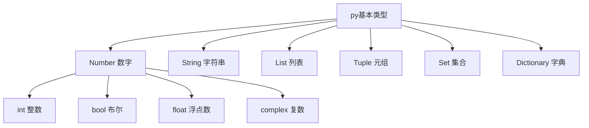

脑图



### 字符串

还是挺复杂的，重要的索引方式：

字符串的截取的语法格式如下：`变量[头下标:尾下标:步长]`

注释的方式同时也是多行字符串的表示方法

还能用 r 除去反斜杠的作用（js 应该就只能双反斜线了吧？）

py 的模板字符串怎么表示？

py 也是用逗号分隔的，用于一行写多条语句，但推荐的都是不写分号，使用换行来替代

缩进相同的一组语句构成一个代码块，我们称之代码组（代码块也叫代码组），我们将首行及后面的代码组称为一个子句(clause)。

import 导入的语法


这里要清晰一下


这个图也很清晰了

列表的索引 相比于 字符串就多了赋值

这个集合运算还是很爽的

```python
# set可以进行集合运算
a = set('abracadabra')
b = set('alacazam')

print(a)
print(b)

print(a - b)     # a 和 b 的差集

print(a | b)     # a 和 b 的并集

print(a & b)     # a 和 b 的交集

print(a ^ b)     # a 和 b 中不同时存在的元素
```

`print({x: x**2 for x in (2, 4, 6)})` 代码还能这么写呢 🤨


py 有一些很简单的关键字，命名时，要注意这些

### 解释器

Python 解释器可不止一种哦，有 CPython、IPython、Jython、PyPy 等。

顾名思义，CPython 就是用 C 语言开发的了，是官方标准实现，拥有良好的生态，所以应用也就最为广泛了。

### 注释

注释居然和多行字符串一样，涨知识了

### 运算符

#### 算数运算符

// 就是向下取整，这个 case 注意一下 -9//2 == -5 （负数的向下取整）

#### 比较运算符

正常的运算符

#### 赋值运算符

+= 这些类似的

:= 海象运算符，不知道干啥的

### 位运算符

`&|^~` 左移 右移

### 逻辑运算符

and or not

把逻辑运算符合

### 成员运算符

in not in（字符串、列表、元组）

### 身份运算符

is is not（id()函数可以直接找到内存地址）

is 比较的是引用， == 比较的是值

```python
>>>a = [1, 2, 3]
>>> b = a
>>> b is a
True
>>> b == a
True
>>> b = a[:]
>>> b is a
False
>>> b == a
True
```

a[:] 就相当于 js 的扩展运算符

### 运算符优先级

记忆一下

py 的运算符啥的还是很简明清晰的，但就是占用的保留字有些多

交互模式下时，\_ 变量是上一个交互的返回值

### 转移字符

\r \b 可以替换、删除原有字符串

F-string 就是模板字符串，这个东西在 py 3.6 才加进去

### 列表

del 可以删除列表元素，append 可以增加列表元素

所谓元组的不可变指的是元组所指向的内存中的内容不可变

字典里没有值，会报错，如要判断是否有的话，要用 in

推导式 comprehensions（又称解析式），是 Python 的一种独有特性

-   列表(list)推导式
-   字典(dict)推导式
-   集合(set)推导式

在 py 中没有 switch case 语句（感觉挺好的，这个没必要）

while else、for else 语句，这个东西有啥用？答：如果是 break 出来的，那么 else 就不会执行，这个挺 nb 的，分清了是 for 条件结束的循环还是 break 结束的循环

pass 这种居然有关键字，厉害呀

### 迭代器与生成器

iter() next() 停止时是 StopIteration 异常

有 yield 的函数就是生成器，生成器返回的是迭代器

> python 中一切都是对象，严格意义我们不能说值传递还是引用传递，我们应该说传不可变对象和传可变对象。

这不就是 js 吗 🙄

### 函数

函数不传定义的参数，会有语法错误

参数定义了关键字，可以使用关键字调用，而不管实际参数的顺序的怎样的

加一个\*号的时候，是不定长参数，传入函数之后是元组表示

加两个\*号时，可以变成字典，而不是元组

加一个\*号 逗号时，\*号后面必须是字典才能传入

> lambda 函数拥有自己的命名空间，且不能访问自己参数列表之外或全局命名空间里的参数。

这个很严格呀

> 将列表当作队列使用也可以把列表当做队列用，只是在队列里第一加入的元素，第一个取出来；但是拿列表用作这样的目的效率不高。在列表的最后添加或者弹出元素速度快，然而在列表里插入或者从头部弹出速度却不快（因为所有其他的元素都得一个一个地移动）。

这个是不是和 js 一样？

列表推导式，这个东西还是有点费劲，但应该挺好用的 `[x+y for x in vec1 for y in vec2]`

### 模块

> sys.path 包含了一个 Python 解释器自动查找所需模块的路径的列表。

这不就是 npm 寻找包的方式嘛（为啥 npm 没有输出这个路径的函数，是我不知道吗？）

居然没有 export（想来也是，应该是全部 export 出去了吧）

导入模块，很容易产生循环引用

包的目录下要有 `__init__.py` 代表这是一个包，还可以有 `__all__.py` 代表 import \* 时候的内容（包有点复杂，没怎么懂，慢慢来吧，这个应该要在实践中理解）

### 输入和输出

'xxx'.format() 类似 printf

`print('常量 PI 的值近似为：%5.3f。' % math.pi)` 这种是老旧的，建议使用上面新的方式

open() 函数用于打开文件 f.read() f.write() 用于读写，最后要记得 f.close()

pickle 模块可以使用文件系统来存储和读取 py 的数据

os 模块用于处理文件和目录

### 错误和异常

首先你写的代码会经过语法分析器，如果有语法错误，它会报出来，并提示一个小箭头：

```
>>> while True print('Hello world')
  File "<stdin>", line 1, in ?
    while True print('Hello world')
                   ^
SyntaxError: invalid syntax
```

接着，如果没有语法错误，那么会往下执行，但这也有可能出现运行时错误，这被称为异常：

```
>>> 10 * (1/0)             # 0 不能作为除数，触发异常
Traceback (most recent call last):
  File "<stdin>", line 1, in ?
ZeroDivisionError: division by zero
>>> 4 + spam*3             # spam 未定义，触发异常
Traceback (most recent call last):
  File "<stdin>", line 1, in ?
NameError: name 'spam' is not defined
>>> '2' + 2               # int 不能与 str 相加，触发异常
Traceback (most recent call last):
  File "<stdin>", line 1, in <module>
TypeError: can only concatenate str (not "int") to str
```

使用 try except 捕获异常，except 后面跟的是错误类型，还可以跟 else 或 finally

使用 raise 抛出异常

```python
with open("myfile.txt") as f:
    for line in f:
        print(line, end="")
```

With 语句可以保证文件被关闭（应该是出了这个作用域，所有的变量都会被销毁吧）

### 面向对象

_可以对比一下 js 的类，然后完善 js 的知识（感觉浏览器的 js 还是有太多系统级别的东西被限制了呀，不像 py 可以看内存地址啥的，不知道 node 行不行呢？）_

类 都是有构造函数的，在其实例化时被调用，一般也有 super() 方法，用于调用父类的值，有公有属性、公有方法、私有属性、私有方法

类有一些专有方法，用于 str() + - 操作符啥的（这让我想到了 c++ 的运算符重载）

> Python 同样支持类的继承，如果一种语言不支持继承，类就没有什么意义

确实，如果不使用继承，类好像真的没有什么意义

py 居然支持多继承 😖，看着感觉有些复杂*（js 支持多继承吗？）*

### 命名空间、作用域

> Python 中只有模块（module），类（class）以及函数（def、lambda）才会引入新的作用域，其它的代码块（如 if/elif/else/、try/except、for/while 等）是不会引入新的作用域的，也就是说这些语句内定义的变量，外部也可以访问

这不就是 es5 吗 😟

错了，相比于 es5 要好一点，因为 py 使用了 global 和 nonlocal 关键字，用于修改外部变量，并且还有一种报错限制：不能在赋值之前使用变量

```
a = 10
def test():
    a = a + 1
    print(a)
test()
```

有点搞不懂这段代码为啥报错？定义了一个局部的 a，但他的值是外部的 a 和 1 的总和，是一行代码里不能同时出现局部 a 和外部 a 吗？因为 a 只有一个，所以冲突了，是吗？

### 标准库

`os.system('ls -l')` 可以执行 cmd 命令

py 有很多官方的处理问题的标准库，但 js 都是社区的，会有安全与稳定的问题（如果自己写，还有维护的问题），但还是可以把社区精品库，当做你奉行的标准库，而且最好锁死版本，防止不稳定的问题发生
