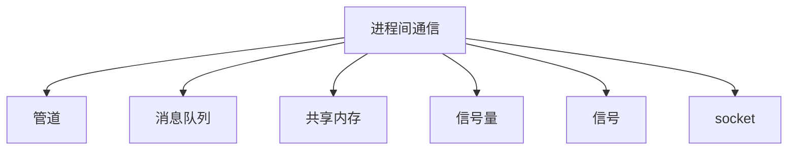

## cpu 是如何执行的

计算机基本结构为 5 个部分，分别是中央处理器（CPU）、内存、输⼊设备、输出设备、总线。

CPU 包含：寄存器、控制单元、逻辑运算单元

如有 4g 内存，但 cpu 想要一次操作所有地址，那就需要 32 位，因为 2^32=4g

1 GHz 的 CPU，指的是时钟频率是 1 G，代表着 1 秒 会产⽣ 1G 次数的脉冲信号

## 存储金字塔

寄存器、 cpu cache、内存、ssd/hdd 硬盘

## 进程、线程基础知识

来自 第四章 4.1

### 进程

cpu 按理说只能执行一个东西，但我们现在使用的电脑都能同时执行多个应用，是因为有进程，每个应用有不同的进程，cpu 会先执行一下这个，再执行一下那个，只不过是切换的速度非常快，导致我们不能发现，所以造成了可以同时执行多个应用的错觉

### 线程

进程切换耗费资源太大了，所以需要一个更小粒度的东西，这个就是线程，首先他不需要切换内存，因为多个线程共享同一个进程的内存空间

### 调度

每一个进程都想占用 cpu 更长的时间，所以出现了进程调度问题

有很多的调度算法，使用银行排队的例子，很生动形象

### 进程之间通信的方式

进程有独立的用户地址空间，如果进程之间想要通信，那就只能通过内核



#### 管道

平常在 shell 中写的竖线就是管道，他可以在两个进程之间传递消息。管道分为匿名管道和命名管道，他们都是在内核中的缓存。

缺点：管道的通信方式是效率低的，不适合进程间频繁地交换数据

#### 消息队列

消息队列是保存在内核中的消息链表。消息队列的生命周期是跟随内核的，而管道的生命周期是跟随进程的。

缺点：通信不及时、附件大小有问题；存在用户态与内核态之间数据拷贝的开销

#### 共享内存

现代操作系统使用的都是虚拟内存技术，两个进程之间可以拿出同一块内存地址，当做虚拟内存，之后获取的就是同样的数据了

#### 信号量

有了共享内存之后，会发生两个进程改同一块内存地址的问题，所以要使得共享的资源受到保护机制。

信号量是一个计数器，有 p 和 v 操作，他们一定要是成对出现的（像是一种锁一样）在某种信号量下不能操作数据，所以达到了保护机制

#### 信号

通过 `kill -l` 命令即可查看系统的信号，比如 ctrl + c （中断任务执行）就是一个信号

### socket

socket（套接字）不仅能实现同一个电脑的进程通信，还能实现不同电脑的通信（如 tcp udp）

## 多线程同步

多个线程操作同一变量时，肯定会产生冲突，所以不能这样，操作变量的地方我们称为临界区，所以只能让一个进程操作临界区，实现这一目的有两种方法：锁、信号量

锁有：等待锁、非等待锁（加锁和解锁都是成对的）

等待锁：当一个资源上锁之后，它就会一直在这里等待，直到这个资源被解锁为止（因为 cpu 是通过时间片机制实现并发的，所以资源是能被解锁的），也叫自旋锁

非等待锁：当一个资源上锁之后，把下个资源加入队列，之后把 cpu 的使用权让出去，通过队列的一些操作，让已经完成的出队

信号量：p 操作、v 操作（p v 都是成对的）

这个更强大一些，不仅能实现互斥，还能实现同步操作。

「哲学家就餐」问题对于互斥访问有限的竞争问题（如 I/O 设备）一类的建模过程十分有用

这里的 p v 操作，以及状态，搞的我有点懵，文章中是这样解释的：

```
信号量
信号量是操作系统提供的⼀种协调共享资源访问的⽅法。
通常信号量表示资源的数量，对应的变量是⼀个整型（ sem ）变量。（semaphore）
另外，还有两个原⼦操作的系统调⽤函数来控制信号量的，分别是：
P 操作：将 sem 减 1 ，相减后，如果 sem < 0 ，则进程/线程进⼊阻塞等待，否则继续，表明 P
操作可能会阻塞；
V 操作：将 sem 加 1 ，相加后，如果 sem <= 0 ，唤醒⼀个等待中的进程/线程，表明 V 操作不
会阻塞；
P 操作是⽤在进⼊临界区之前，V 操作是⽤在离开临界区之后，这两个操作是必须成对出现的。
```

## 死锁

当多个线程操作多个共享数据时，就有可能发生死锁，死锁的四个条件：

1. 互斥条件
2. 持有并等待条件
3. 不可剥夺条件
4. 环路等待条件

一般通过资源有序分配法来破坏环路等待条件。

锁一般又分为：互斥锁、自旋锁（忙等待锁）、读写锁、悲观锁、乐观锁

> 乐观锁虽然去除了加锁解锁的操作，但是⼀旦发⽣冲突，重试的成本⾮常⾼，所以只有在冲突概率⾮常 低，且加锁成本⾮常⾼的场景时，才考虑使⽤乐观锁。

## 调度算法

### 先来先服务算法

有利于长作业，适用于 cpu 繁忙型作业的系统，不利于短作业，不适用于 I/O 繁忙型的系统

### 最短作业优先调度算法

优先选择运行时间最短的作业来进行，有助于提高系统吞吐量，不利于长作业

### 高响应比优先调度算法

权衡了短作业和长作业，每次进程调度时，先计算响应比优先级，优先级高的就先服务

$$
响应比优先级 = \frac{等待时间+要求服务时间}{要求服务时间}
$$

### 时间片轮转调度算法

使用最广泛的算法（也公平），但时间的设置值得考究，太短或太长都不好，一般 20ms~50ms 较为合适

### 最高优先级调度算法

上面时间片算法每个都是公平的，但实际情况不想这样，需要有一个优先级，所以就是这算法了，优先级有静态优先级和动态优先级之分，静态的就是进程刚创建就被赋予了的，定死的，而动态优先级是随着等待的时间而变化的

缺点：可能导致低优先的任务永远不会执行

### 多级反馈队列调度算法

多个队列分不同优先级执行，优先级由高到低，时间片由小到大，一定是先执行完优先级高的队列，之后再去执行优先级低的队列，是上面两个算法的综合

## 页面置换算法

当页表不在内存中时，那么就需要去磁盘中取这个页表，之后放到内存中，那如果内存满了，应该怎么办呢？就需要页面置换算法了，需要把暂时没用的东西换到磁盘里，之后把当前这个页表再放到内存中的操作，但是该怎么换呢？就要看这里的算法了，目标是尽量减少页面换入换出的次数

### 最佳页面置换算法

置换在未来最长时间不访问的页面，因为实际情况下我们不知道未来是什么样的，所以此算法仅用来对比你的算法是否足够优秀

### 先进先出置换算法

每次置换时，把驻留时间最长的给替换掉

### 最近最久未使用置换算法

LRU 算法，找出最长时间没有使用的页面，把它置换了，因为过去很长时间没有被使用了，那么大概可以预测：未来较长一段时间内也不会被使用。但是实际中 LRU 耗费的资源实在太大了，所以较少被使用。

### 时钟页面置换算法

做成一个环形链表，像是时钟一样，当发生缺页中断时就旋转时钟，并且改变标志位

### 最不常用算法

LFU 算法，每次访问到页表时计数器加一，当发生缺页中断时，置换计数器最小的那个页面，缺点：没有考虑时间的问题，可能有个很久之前的页面访问非常频繁，导致计数器值很大，但现在访问的页面也会非常频繁，但总是置换不了以前的那个，这种情况的解法也是有的，比如定期把时间太久的计数器除 2

## 磁盘调度算法

加快寻道（访问磁盘数据）的速度

### 先来先服务

按照顺序，来一个执行一个（这种算法一般先是要保证正确性，之后再是提高性能），缺点：总共算下来，会导致磁道移动过长

### 最短寻道时间优先算法

选择离当前磁道最近的位置，缺点：可能会产生饥饿现象，离的远的，一直不服务。

### 扫描算法

也叫电梯算法，先会只朝着一个方向走，走到头之后再往反方向走，就像电梯一样，性能较好不会产生饥饿现象，但中间部分的响应率高，会产生差异现象

### 循环扫描算法

只按照一个方向扫描，对于各个磁道响应均匀

### look 和 c-look

Scan 的升级算法是 look，他可以不移动到磁盘的终点或起点，它只是移动到最远点

## 文件系统

## 设备管理

CPU 与内存通过设备控制器控制设备，设备控制器有自己的芯片和寄存器，他的寄存器分为 3 种：数据寄存器、命令寄存器、状态寄存器

输入输出设备可分为两大类：块设备和字符设备，块设备

CPU 如何与设备的控制寄存器和数据缓冲器进行通信？

1. 端口 io：寄存器被分配一个端口，通过特殊汇编指令操作
2. 内存映射 io：将寄存器映射到内存控件设备控制器的数据如何发送给 CPU？轮询（比较傻瓜）、中断设备驱动程序中，有中断处理函数

## 什么是一致性哈希？

大多数网站背后是多台服务器（也叫节点），他们组成集群对外服务，那么多节点如何分配客户端的请求？

这其实是「负载均衡」问题，解决负载均衡的算法很多，不同算法对应解决不同问题。我们可以想个最简单的，就是引入一个负载均衡层，这一层负责轮流转发请求，比如有3个节点并且3个请求过来，那么就每个节点一个请求，还可以优化下，比如有性能好的节点那么就给他的权重高一些，能处理的请求就多一些，这个就叫加权轮询算法，此算法是无法对应分布式系统的，因为分布式系统每个节点存储的数据是不同的，他根据key-value把数据存储到不同节点上，这会造成某一个请求只能在当前节点上而不能在其他节点上的情况，那如何做分布式系统的负载均衡呢？

你可能想到了哈希，把数据的key按照hash(key)之后再取余节点的个数，就能一一对应请求与节点，但是别忘了扩容与缩容的情况，假设扩容了，那么hash(key)就与之前的节点对应不上了，就需要节点之间的数据迁移，这个迁移量最坏情况下可能是全部数据都要迁移，这是不可接收的，所以就出现了一致性哈希算法，首先还是hash(key)，但取模发生了变化，要取模固定值`2^32`，你可以把0到`2^32`看出一个环，叫哈希环，这时可以把节点映射到环上，再把key也映射到环上，这时key的数据就应该存储在顺时针的第一个节点上，这样如果出现了扩容，那么最多也就改变两个节点而已，而且还可以增加虚拟节点使分布更加均匀。


## 如何查看网络的性能指标

4个指标：带宽、延时、吞吐率、PPS（packet per second）

网络配置可使用`ifconfig`、`ip`命令查看

socket 信息可使用`netstat`和`ss`命令查看

网络吞吐率和PPS使用`sar`命令查看

连通性和延时使用`ping`查看

## 从日志分析pv uv

使用 nginx 的 access.log 日志结合命令行分析 pv 与 uv

用命令行实现查看日志与分组、排序和去重等操作

## 主动思考

尝试着实现一下这种情况：（好像挺难的）

```
考虑这样一种情况：一个列表里所有元素都是0，线程"set"从后向前把所有元素改成1，而线程"print"负责从前往后读取列表并打印。
那么，可能线程"set"开始改的时候，线程"print"便来打印列表了，输出就成了一半0一半1，这就是数据的不同步。为了避免这种情况，引入了锁的概念。
https://www.runoob.com/python3/python3-multithreading.html
```
